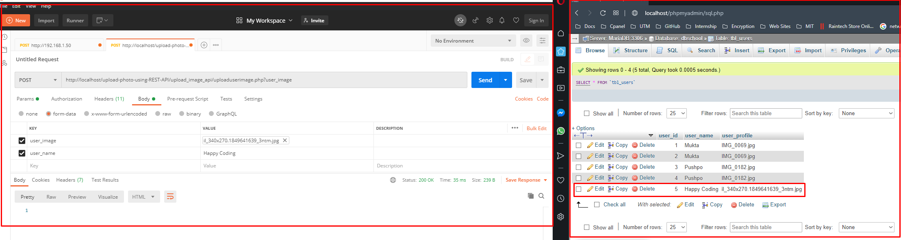

# upload-photo-using-REST-API

**Please follow the instruction first**

First >> Choose you database

Then >> create new table 
     >> go to sql tab
     >> copy code from txt file and paste here
     
Then >> Go to your www directory
     >> Extract zip or copy and past "(upload-photo-using-REST-API)" folder into www dir
     
Then >> Open your postman and test the output 

*Note* Don't forget to change the database configuration details if you do another one.

#HappyCoding

Sample Output

